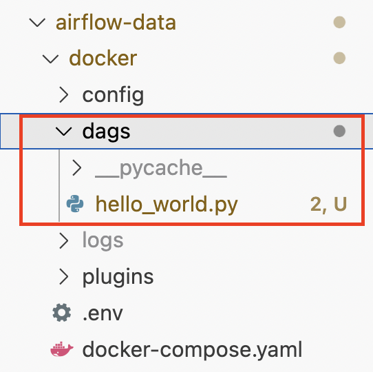

# Introduction to Airflow 1	(Day-1)
## Prerequisites
- Activate docker
- An Airflow instance is composed of a scheduler, an executor, a webserver, and a metadata database. Run the Airflow instance locally via docker-compose.

    ```
        source docker/.env
        docker-compose -f docker/docker-compose.yaml up
    ```
- Open http://localhost:8080/home in browser, fill out credentials: `airflow/airflow`. This is how the Aiflow dashboard looks like: 


## Apache Airflow

Apache Airflow is an open-source workflow management platform, which includes defining, executing, and monitoring workflows. Workflows are defined using `DAGs` (Directed Acyclic Graphs). In a DAG, there are a set of `Tasks` to be executed.

In growing Big Data use cases, Airflow helps to maintain, monitor and stitch together more complex and depending jobs into an end-to-end workflow.

## Concept of DAG, Task, and Operator


- Directed Acyclic Graph (DAG)


In Airflow, a workflow is defined as a DAG (Directed Acyclic Graph) that contains individual units of work called Tasks. In simple terms, a DAG is a graph with nodes connected via directed edges. Also, there should be no cycles within such a graph. 

Suppose in an ELT pipeline, we define a DAG contains some Tasks, such as: 
- extract data from one or more sources 
- load data to our data-warehouse
- run data transformation
- send email notification when error happens


Whenever a DAG is triggered a DAGRun is created, so a DAGRun is an instance of the DAG with an execution timestamp. 

- Operator
Operator is a template or class for performing a specific task. If we want to execute a Python script, we need a `PythonOperator`. If we want to execute Bash command, we need `BashOperator`. There are [built-in operators](https://airflow.apache.org/docs/apache-airflow/stable/_api/airflow/operators/index.html), such as: `EmailOperator`, `EmptyOperator`, etc.

We can also install more operators from [Provider packages](https://airflow.apache.org/docs/apache-airflow-providers/index.html) to further extend Airflow’s functionalities.


- Task
A task is an instantiation of an operator and simply can be thought of as a unit of work that is represented as a node in a DAG.

Whenever a Task is running, a task instance is created. A task instance belongs to DAGRuns, has an associated `execution_date`. Task instances go through various states, such as “running,” “success,” “failed,” “skipped,” “retry,” etc. Each task instance (and task) has a life cycle through which it moves from one state to another.

## Create our first DAG on Airflow 

- We are going to create our first DAG that will print a 'hello world' message to the log. The code can be found [here](./docker/dags/hello_world.py). The [DAG code](./docker/dags/hello_world.py) is placed on our AIRFLOW_HOME directory under the dags folder.




- Let's understand the code. In the first few lines, we are simply importing a few packages from airflow.

    ```
        from datetime import datetime
        from airflow import DAG
        from airflow.operators.python_operator import PythonOperator

    ```

- Then, we define a Python function that will print the hello message.

    ```
        def print_hello():
            return 'Hello world from first Airflow DAG!'
    ```

- We declare the DAG arguments, such as: `name`, `description`, `schedule_interval`, `start_date` and `catchup`. 
    - `schedule_interval` means the interval of time from the minimum `start_date` at which we want our DAG to be triggered. The value can be `None`,`@once`,`@hourly`,`@daily`,`@weekly`,`@monthly`,`@yearly` or the Cron expression (see guide in [crontab.guru](https://crontab.guru/)).
    - `start_date` means the date at which DAG will start being scheduled.
    - `catchup=False` setting to prevent Airflow from having the DAG runs any past scheduled intervals that have not been run (backfill). By default, the `catchup` value is `True`.

    ```
        dag = DAG(
                'hello_world', 
                description='Hello World DAG',
                schedule_interval='* * * * *',
                start_date=datetime(2022, 10, 21), 
                catchup=False
            )
    ```

- Next, we define the operator and call it the hello_operator. In essence, this uses the in-built PythonOperator to call our print_hello function. We also provide a task_id to this operator.

    ```
        operator_hello_world = PythonOperator(task_id='hello_task', python_callable=print_hello, dag=dag)
    ```

- The last statement specifies the order of the operators. In this case, we have only one operator, no upstream or downstream task.
    ```
        operator_hello_world
    ```

- Let's check it through Airflow dashboard. Find the name defined for our DAG `hello_world` on the list of DAGs.


- Click on the `hello_world` DAG, then we will be going through the detail page that shows a sequence of green-squared status meaning the DAG runs succesfully in a scheduled interval.


- Click on the green-squared status, then click on the tab `Logs` to see the log of the DAG.


## TASK

1. [TBD] Create DAG that will run in every 3 hours.
2. [TBD] Create the upstream task and downstream task.

# Introduction to Airflow 2	(Day-2)

## Create your First Operator

## Concept of XCom, Hooks and Connection

## Implement XCom, Hooks and Connection in your DAG

## [TASK] TBD

# Review Task (Day-3)


# Schedule your data pipeline (Day-4)

In this section, we are going to implement scheduling for our ETL pipeline that we have learned.

## Understand how to integrate a data pipeline into airflow

https://www.freecodecamp.org/news/orchestrate-an-etl-data-pipeline-with-apache-airflow/

Setup a DAG script
- Prepare the dataset (some CSV files or URL)
- Create DAG to ingest the dataset to our datawarehouse with python
    1. define when the DAG will be run, start_date
    2. define the interval of the DAG
- Setup Postgresql DB Connection
- Define tasks in a DAG : 
    1. task-1: define empty operator
    2. task-2: create connection and table in postgresql with PostgresOperator
    3. task-3: ingest data from file with PythonOperator
    4. task-4: command to move data from Postgresql to Citus with Airbyte
    5. task-5: dbt command to transform data with DbtOperator, BashOperator or SSHOperator
- Create dependencies between tasks
- Test the workflows

## Scheduling ingestion code with PythonOperator

## Scheduling dbt code with BashOperator

## Send success/failed notification to email

## [TASK] TBD