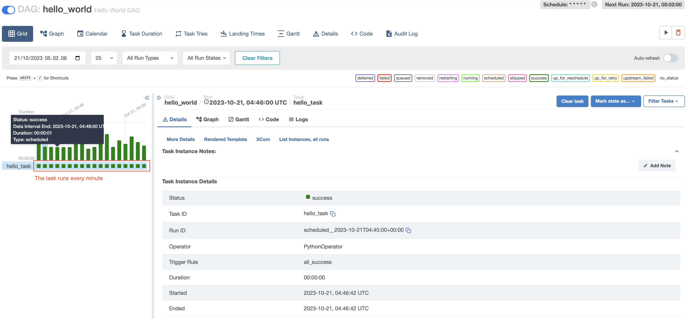
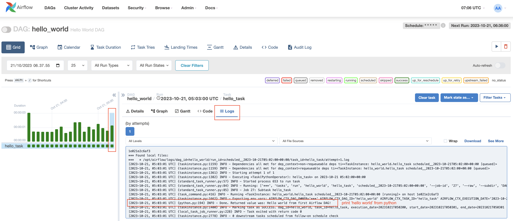
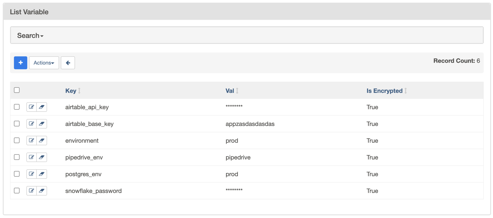
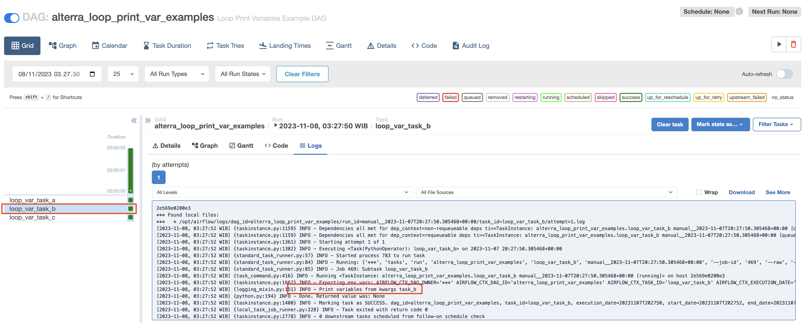
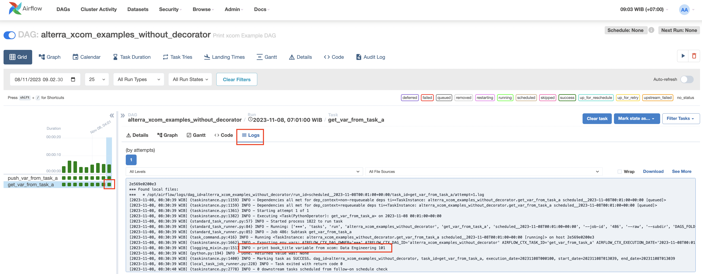

# Outline

1. [Introduction to Airflow 1 (Day-1)](#introduction-to-airflow-1-day-1)

2. [Introduction to Airflow 2 (Day-2)](#introduction-to-airflow-2-day-2)

3. [Schedule Our Data Pipeline (Day-3)](#schedule-our-data-pipeline-day-3)

4. [Schedule your data pipeline (Day-4)](#schedule-your-data-pipeline-day-4)

# Introduction to Airflow 1	(Day-1)
## Prerequisites
- Activate docker
- An Airflow instance is composed of a scheduler, an executor, a webserver, and a metadata database. Run the Airflow instance locally via docker-compose.

    ```
        source docker/.env
        docker-compose -f docker/docker-compose.yaml up
    ```
- Open http://localhost:8080/home in browser, fill out credentials: `airflow/airflow`. This is how the Aiflow dashboard looks like: 


## Apache Airflow

Apache Airflow is an open-source workflow management platform, which includes defining, executing, and monitoring workflows. Workflows are defined using `DAGs` (Directed Acyclic Graphs). In a DAG, there are a set of `Tasks` to be executed.

In growing Big Data use cases, Airflow helps to maintain, monitor and stitch together more complex and depending jobs into an end-to-end workflow.

## Concept of DAG, Task, and Operator


- Directed Acyclic Graph (DAG)


    In Airflow, a workflow is defined as a DAG (Directed Acyclic Graph) that contains individual units of work called Tasks. In simple terms, a DAG is a graph with nodes connected via directed edges. Also, there should be no cycles within such a graph. 

    Suppose in an ELT pipeline, we define a DAG contains some Tasks, such as: 
    - extract data from one or more sources 
    - load data to our data-warehouse
    - run data transformation
    - send email notification when error happens

    

    Whenever a DAG is triggered a DAGRun is created, so a DAGRun is an instance of the DAG with an execution timestamp. 

- Operator
    Operator is a template or class for performing a specific task. If we want to execute a Python script, we need a `PythonOperator`. If we want to execute Bash command, we need `BashOperator`. There are [built-in operators](https://airflow.apache.org/docs/apache-airflow/stable/_api/airflow/operators/index.html), such as: `EmailOperator`, `EmptyOperator`, etc.

    We can also install more operators from [Provider packages](https://airflow.apache.org/docs/apache-airflow-providers/index.html) to further extend Airflow’s functionalities.


- Task
    A task is an instantiation of an operator and simply can be thought of as a unit of work that is represented as a node in a DAG.

    Whenever a Task is running, a task instance is created. A task instance belongs to DAGRuns, has an associated `execution_date`. Task instances go through various states, such as “running,” “success,” “failed,” “skipped,” “retry,” etc. Each task instance (and task) has a life cycle through which it moves from one state to another.

## Create our first DAG on Airflow 

- We are going to create our first DAG that will print a 'hello world' message to the log. The code can be found [here](./docker/dags/hello_world.py). The [DAG code](./docker/dags/hello_world.py) is placed on our AIRFLOW_HOME directory under the dags folder.


- Let's understand the code. In the first few lines, we are simply importing a few packages from airflow.

    ```
        from datetime import datetime
        from airflow import DAG
        from airflow.operators.python_operator import PythonOperator

    ```

- Then, we define a Python function that will print the hello message.

    ```
        def print_hello():
            return 'Hello world from first Airflow DAG!'
    ```

- We declare the DAG arguments, such as: `name`, `description`, `schedule_interval`, `start_date` and `catchup`. 
    - `schedule_interval` means the interval of time from the minimum `start_date` at which we want our DAG to be triggered. The value can be `None`,`@once`,`@hourly`,`@daily`,`@weekly`,`@monthly`,`@yearly` or the Cron expression (see guide in [crontab.guru](https://crontab.guru/)).
    - `start_date` means the date at which DAG will start being scheduled.
    - `catchup=False` setting to prevent Airflow from having the DAG runs any past scheduled intervals that have not been run (backfill). By default, the `catchup` value is `True`.

    ```
        dag = DAG(
                'hello_world', 
                description='Hello World DAG',
                schedule_interval='* * * * *',
                start_date=datetime(2022, 10, 21), 
                catchup=False
            )
    ```

- Next, we define the task and call it the `hello_operator` task. The task uses the in-built `PythonOperator` to call our `print_hello` function. We also provide a `task_id` to this task.

    ```
        operator_hello_world = PythonOperator(task_id='hello_task', python_callable=print_hello, dag=dag)
    ```

- The last statement specifies the order of the task. In this case, we have only one task, no upstream or downstream task.
    ```
        operator_hello_world
    ```

- Let's check it through Airflow dashboard. Find the name defined for our DAG `hello_world` on the list of DAGs.


- Click on the `hello_world` DAG, then we will be going through the detail page that shows a sequence of green-squared status meaning the DAG runs succesfully in a scheduled interval.



- Click on the green-squared status, then click on the tab `Logs` to see the log of the DAG.



## TASK

1. [TBD] Create DAG that will run in every 3 hours.
2. [TBD] Create the upstream task and downstream task.

# Introduction to Airflow 2	(Day-2)

## Create your First Operator

Now we’ll create our own operator that extends previous HelloWorld example, we’ll call the HelloWorldOperator. It will print a message on the console with the argument passed into it. The code can be found here: 
- [Operator code](./docker/plugins/operators/hello_operator.py)
- [DAG code](./docker/dags/hello_world_operator.py)

- Let's go through the [operator code](./docker/plugins/operators/hello_operator.py). First, create a sub directory `operators` under `plugins`. Then, create a file named `hello_operator.py`. 

- All operators are derived from the `BaseOperator` class. The code for our `HelloWorldOperator` appears below.

```
class HelloWorldOperator(BaseOperator):
    def __init__(self, param1, param2, *args, **kwargs) -> None:
        self.param1 = param1
        self.param2 = param2
        super(HelloWorldOperator, self).__init__(*args, **kwargs)


```

- The line that contains `super` function is used to refer to the `BaseOperator` class or `HelloWorldOperator`

- The main logic of our operator is in the `execute` method. The `HelloWorldOperator` will simply print a message to a console.

```
    def execute(self, context):
        print(f'Hello World from Operator: {self.param1} {self.param2}')
```

- Now, we can import our custom operator to the DAG. Let's runthrough to our [DAG code](./docker/dags/hello_world_operator.py).

- The DAG declaration is similar with the previous example. We will use our custom `HelloWorldOperator` operator to print message to the console. Operator helps us to avoid repetition function.

```
    custom_operator_hello_task = HelloWorldOperator(
        param1='This is an example operator by', 
        param2='alterra-student',
        task_id='hello_world_task', 
        dag=dag
    )

```

- Next, specify the order of the task.

```
    custom_operator_hello_task
```

## Define Airflow Variables with `variables` and `xcom`

There are several ways to store information in Airflow, such as: 

- Airflow `variables` that is used to store information that doesn't change too frequently.

- Airflow `xcom` can be used to pass parameters between `tasks`. Use `xcom` when the parameters are likely to change with each DAG run. 

- Airflow `params` can be used to pass information that is specific to a DAG. 

Now, we are going to learn about airflow `variables` and `xcom`.

### `variables` in Airflow

- `variables` are a key-value store that contain settings that can be queried from our `tasks`. `variables` can be set via Airflow dashboard, Airflow CLI, imported as a JSON file or programmatically within an Airflow `tasks`.



- Let's implement `variables` in our DAG. In the first example, we are going to access `variables` from a DAG programmatically and then print the `variables` to the console. The code can be found [here](./docker/dags/get_var_example.py).

- First of all, create our variables by clicking on Admin > Variables, then add a new variable. This variable is stored in metadata store.


- Create `book_entities` variable that contains a json value

```
    {
        "title": "book-title-example",
        "description": "Lorem ipsum dolor sit amet, consectetur adipiscing elit. Cras sodales dui elit, sed venenatis magna pellentesque sit amet. Praesent sollicitudin enim et lacus rhoncus finibus. Integer interdum sed sem ut interdum. Nullam sagittis magna felis, et feugiat diam pellentesque a.",
        "isbn": null,
        "extension": "pdf"
    }
```

- Then, `program_name` variable that contains text value `alterra material: learning variable`

- The code below retrieves the Airflow `variables` and deserializes json value.

```
    book_entities_var = Variable.get("book_entities", deserialize_json=True)
    program_name_var = Variable.get("program_name")
```

- Then, lets' print out the variables to the console.

```
    print(f'Print variables, program_name {program_name_var}')
    print(f'Print variables, book_entities  {book_entities_var}')
```

- Run the DAG, then go to the console and see what the variables are printed out. 


- The console


- In the next example, let's create a little bit advance example. We are going to generate `tasks` based on the array value in `variable`. The code can be found [here](./docker/dags/loop_print_var_example.py).

- First, let's define a JSON variable named `looping_task` with value: 

```
{
    "task_name" : ["task_a", "task_b", "task_c"]
}

```

- The goal is to generate 3 `tasks` named: `task_a`, `task_b` and `task_c`. Each task will print out the task name. In the DAG, define a function `print_var(**kwargs)` that will print out a value passes via `kwargs`.

```
    def print_var(**kwargs):
        print(f'Print variables from kwargs {kwargs["task"]}')

```

- Retrieve the airflow `variable` named `looping_task` and then deserialize the json value.

```
    looping_tasks_var = Variable.get("looping_task", deserialize_json=True)["task_name"]

```

- Iterate over the `looping_tasks_var`, then execute the `print_var` function via `PythonOperator`.

```
    for task_name in looping_tasks_var:
        PythonOperator(
            task_id=f'loop_var_{task_name}',
            python_callable=print_var,
            op_kwargs={
                "task": task_name
            }
        )
```

- `op_kwargs` will pass the variable to the python function in `python_callable` value.

- In the airflow dashboard, find a DAG named `alterra_loop_print_var_examples`, then we can see there are 3 tasks created based on the arrays defined in airflow `variables`.


- Let's trigger run the DAG. After the DAG run completelt, choose a random task, let's say `loop_var_task_b` task, then see the console.



### `xcom` (cross-communication) in Airflow

- `xcom` in Airflow is the way to pass data from one `Task`/`Operator` to another. 


- We push a variable in a task (method `xcom_push()`) and pull the variable from another task (method `xcom_pull()`). 

- The variable is stored in an airflow metadabase in postgres, with the limit size of 1 GB. Therefore, `xcom` is not designed to pass large dataset.

- The `xcom` variable is stored in the airflow meta database with an associated execution date, task instance, and DAG run by the sending task and then retrieved from the database by the intended recipient task.

- The `xcom` implementation can be seen in this [code](./docker/dags/xcom_example_native.py). Inside the DAG, we can see 2 python functions respectively: 

- `push_var_from_task_a` pushes a variable to database

```
    def push_var_from_task_a(ti=None):
        ti.xcom_push(key='book_title', value='Data Engineering 101')
```

- `get_var_from_task_a` method retrieves a variable and print to the console.

```
    def get_var_from_task_a(ti=None):
        book_title = ti.xcom_pull(task_ids='push_var_from_task_a', key='book_title')
        print(f'print book_title variable from xcom: {book_title}')
```

- Execute python function via `PythonOperator`

```
    push_var_from_task_a_task = PythonOperator(
        task_id = 'push_var_from_task_a',
        python_callable = push_var_from_task_a
    )

    get_var_from_task_a_task = PythonOperator(
        task_id = 'get_var_from_task_a',
        python_callable = get_var_from_task_a
    )

```

- Specify the order of the task: push the variable, then retrieve it.

```
    push_var_from_task_a_task >> get_var_from_task_a_task
```

- In the DAG `alterra_xcom_examples_without_decorator` detail information, we can see there are task: `push_var_from_task_a` and `get_var_from_task_a`. Click on the green-squared status on task `get_var_from_task_a` to see the printed out.



- The list of `xcom` can be seen in Admin > Xcom


- Yeay! We have already learned about Airflow `xcom`. Now, we will improve the code using `@task` decorator or TaskFlow API. 

- The `@task` decorator is highly recommended over the native `PythonOperator` to execute Python callables. See this [code](./docker/dags/xcom_example_decorator.py).

```

    @task
    def push_var_from_task_a(ti=None):
        ti.xcom_push(key='book_title', value='Data Engineering 101')
    
    @task
    def get_var_from_task_a(ti=None):
        book_title = ti.xcom_pull(task_ids='push_var_from_task_a', key='book_title')
        print(f'print book_title variable from xcom: {book_title}')

```


## TASKS
1. Suppose we define a new task that push a variable to xcom.
2. How to pull multiple values at once?

## Understanding `Hook` and `Connection` 

### Airflow `Hook`
A `hook` is an abstraction of a specific API that allows Airflow to interact with an external system. To use a `hook`, you typically need a `conn_id` from `Connections` to connect with an external system. For example, the `PostgreHook` automatically looks for the Connection with a `conn_id` of postgres_default if you don’t pass one in.

Some built-in hook are: `HTTPHook`, `S3Hook`, `PostgresHook`, `MysqlHook`, `SlackHook`, etc.

The difference from `operator` is, `operator` provides a way to create tasks that may or may not communicate with some external services, while `hook` are reusable block that manage interaction with external services.

Example of `hook`: 
- [TBD] insert data to postgresql with `PostgresHook`

### Airflow `connection`

We need Airflow `connection` to make the DAG be able to interact with an external tools (http, AWS, GCP or dbt service). A `connection` consists of a set of parameters, such as: username, password, host, etc. with a unique `ConnectionID`

There are 2 ways to define a `connection`: 

    - In the Airflow metadata database (using the CLI or the UI). When you create a `connection` in the database, each time a task needs this `connection`, it requests the database. If you have many tasks, that can drastically increase the workload on your database.

    - In an Environment Variables. With `connection` in Environment Variables, the task doesn't need to request the database. Airflow checks if the corresponding `connection` exists and grabs it without accessing the database. Again, at scale, this can help reduce the number of requests on your database.On top of that, `connection` defined in Environment Variables do not show up in the Airflow UI or using airflow `connection` list. 

Now, let's create a DAG that call an API to to predict gender based on name via [gender-api](https://gender-api.com/v2), then print the result to the console. 
We will implement Airflow connection and SimpleHTTPOperator on it.

Steps: 
- Create account with your email on `https://gender-api.com/v2`
- Generate bearer token
- Go to Airflow dashboard, then add new connection.

[TBD]

### TASK
- Create data pipeline that extract data from gender-api with SimpleHTTPOperator 
- Load data to postgresql with PostgresHook

# Schedule Our Data Pipeline (Day-3)

In this section, we are going to implement scheduling for our ETL pipeline that we have learned.

How to decompose dag based on its best practice: https://docs.astronomer.io/learn/dag-best-practices

## Understand how to integrate a data pipeline into airflow

https://www.freecodecamp.org/news/orchestrate-an-etl-data-pipeline-with-apache-airflow/

Setup a DAG script
- Prepare the dataset (some CSV files or URL)
- Create code to ingest the dataset to our datawarehouse with python
    1. define when the DAG will be run, start_date
    2. define the interval of the DAG
- Setup Postgresql DB Connection
- Define tasks in a DAG : 
    1. task-1: define empty operator
    2. task-2: create connection and table in postgresql with PostgresOperator
    3. task-3: ingest data from file with PythonOperator
    4. task-4: command to move data from Postgresql to Citus with Airbyte
    5. task-5: dbt command to transform data with DbtOperator, BashOperator or SSHOperator
- Create dependencies between tasks
- Test the workflows

## Scheduling ingestion code with PythonOperator


# Schedule Our Data Pipeline (Day-4)

## Scheduling dbt code with BashOperator

## Send success/failed notification to email

## [TASK] TBD